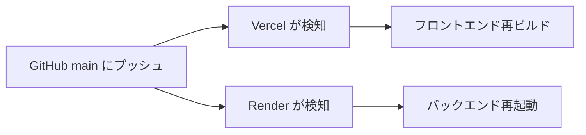

# バトルライン デプロイ手順書

本ドキュメントでは、Render（バックエンド）と Vercel（フロントエンド）を使用したデプロイ手順を説明します。

## 前提条件

- GitHub アカウントを持っていること
- リポジトリが GitHub にプッシュ済みであること
- Render および Vercel のアカウントがあること（無料枠で利用可能）

---

## フェーズ 1: バックエンドのデプロイ (Render)

> [!IMPORTANT]
> **バックエンドを先にデプロイしてください。** フロントエンドの環境変数にバックエンドのURLが必要です。

### 1.1 Render でプロジェクトを作成

1. [Render](https://render.com) にログインし、ダッシュボードを開く
2. **「New +」** → **「Web Service」** を選択
3. GitHub リポジトリ `battle-line-web` を接続

### 1.2 ビルド・起動設定

以下の設定を入力します：

| 項目 | 値 |
|:-----|:---|
| **Name** | `battle-line-server`（任意） |
| **Region** | `Singapore` または `Oregon`（お好みで） |
| **Branch** | `main` |
| **Runtime** | `Node` |
| **Build Command** | `npm install` |
| **Start Command** | `node server.js` |

### 1.3 プランの選択

- **Free** プランを選択（スリープ有り、個人利用には十分）

> [!WARNING]
> **Free プランの制限**: アイドル状態が15分続くとサーバーがスリープします。再起動には15〜30秒かかります。常時稼働が必要な場合は有料プランを検討してください。

### 1.4 デプロイ実行

**「Create Web Service」** をクリックしてデプロイを開始します。

デプロイが完了すると、以下のような URL が発行されます：
```
https://battle-line-server.onrender.com
```

> [!NOTE]
> この URL は次のフェーズ 2 で使用します。メモしておいてください。

---

## フェーズ 2: フロントエンドのデプロイ (Vercel)

### 2.1 Vercel でプロジェクトを作成

1. [Vercel](https://vercel.com) にログイン
2. **「Add New...」** → **「Project」** を選択
3. GitHub リポジトリ `battle-line-web` をインポート

### 2.2 ビルド設定

Vercel は自動で Vite プロジェクトを検出しますが、以下を確認してください：

| 項目 | 値 |
|:-----|:---|
| **Framework Preset** | `Vite` |
| **Build Command** | `npm run build`（デフォルト） |
| **Output Directory** | `dist`（デフォルト） |
| **Install Command** | `npm install`（デフォルト） |

### 2.3 環境変数の設定

**Environment Variables** セクションで以下を設定：

| Key | Value | 備考 |
|:----|:------|:-----|
| `VITE_SERVER_URL` | `https://battle-line-server.onrender.com` | フェーズ 1 で取得した Render の URL |

> [!CAUTION]
> 末尾にスラッシュ (`/`) を付けないでください。

### 2.4 デプロイ実行

**「Deploy」** をクリックしてデプロイを開始します。

デプロイが完了すると、以下のような URL が発行されます：
```
https://battle-line-web.vercel.app
```

---

## フェーズ 3: Render 側の CORS 設定

Vercel のフロントエンド URL が確定したら、Render 側で接続を許可する必要があります。

### 3.1 Render の環境変数を設定

Render のダッシュボードで **Environment** セクションを開き、以下の環境変数を設定：

| Key | Value | 備考 |
|:----|:------|:-----|
| `PORT` | `8000` | boardgame.io サーバーのリッスンポート |
| `ALLOWED_ORIGIN` | `https://battle-line-web.vercel.app` | Vercel で発行されたフロントエンドの URL |

> [!IMPORTANT]
> **`ALLOWED_ORIGIN`** にはフロントエンドの URL を設定します。これにより、そのオリジンからの WebSocket 接続が許可されます。

### 3.2 再デプロイ

環境変数を更新後、Render は自動で再デプロイされます。手動で再デプロイする場合は **「Manual Deploy」** → **「Deploy latest commit」** を選択してください。

---

## フェーズ 4: 動作確認

### 4.1 基本的な接続確認

1. Vercel の URL にアクセス（例: `https://battle-line-web.vercel.app`）
2. 画面が正しく表示されることを確認
3. ブラウザの開発者ツール > Console でエラーがないことを確認

### 4.2 マルチプレイヤー動作確認

1. 2つのブラウザ（またはシークレットウィンドウ）で同じ URL にアクセス

2. 以下のようにクエリパラメータを設定してアクセス:
   ```
   https://your-app.vercel.app/?matchID=test123&playerID=0
   https://your-app.vercel.app/?matchID=test123&playerID=1
   ```

3. 片方でカードを操作し、もう片方で同期されることを確認

---

## トラブルシューティング

### WebSocket 接続エラー

**症状**: Console に `WebSocket connection failed` と表示される

**対処法**:
1. Vercel の環境変数 `VITE_SERVER_URL` が正しいか確認
2. Render のサービスがスリープしている場合は、数秒待つ（Free プランは15〜30秒でウェイクアップ）
3. Render のログで起動完了を確認

### CORS エラー

**症状**: Console に `Access-Control-Allow-Origin` 関連のエラーが表示される

**対処法**:
1. Render 側の `ALLOWED_ORIGIN` 環境変数に Vercel の URL が正しく設定されているか確認
2. URL の末尾にスラッシュがないか確認
3. Render を再デプロイ

### ビルドエラー (Vercel)

**症状**: デプロイが `Build Failed` で終了する

**対処法**:
1. ローカルで `npm run build` を実行してエラーがないか確認
2. TypeScript や ESLint のエラーを修正してから再プッシュ

---

## 参考: 自動デプロイフロー

一度設定が完了すると、以下のフローで自動デプロイされます：



---

## 付録: 環境変数まとめ

### Render (バックエンド)

| Key | Value | 用途 |
|:----|:------|:----|
| `PORT` | `8000` | サーバーのリッスンポート |
| `ALLOWED_ORIGIN` | Vercel の URL | CORS で許可するフロントエンドのオリジン |

### Vercel (フロントエンド)

| Key | Value | 用途 |
|:----|:------|:----|
| `VITE_SERVER_URL` | Render の URL | WebSocket 接続先のバックエンドサーバー |

---

## 付録: コード内での環境変数の使用箇所

### server.js (バックエンド)
```javascript
const server = Server({
  games: [BattleLine],
  origins: [
    Origins.LOCALHOST, 
    process.env.ALLOWED_ORIGIN || 'https://myapp.vercel.app'
  ],
});

const PORT = parseInt(process.env.PORT || '8000', 10);
```

### src/App.tsx (フロントエンド)
```typescript
const server = import.meta.env.VITE_SERVER_URL || `${protocol}//${hostname}:8000`;
```
